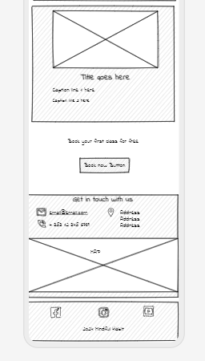
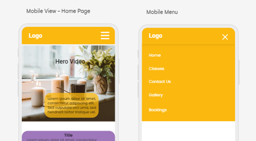

# Mindful Habit 
[View my live site here](https://abigail-ryan.github.io/mindful-habit/index.html)

Mindful Habit is a site for women of all ages to learn about mindfulness. Mindful Habit provides users with beginner group classes to learn to practice mindfulness daily.
Users of this site can access all the information they need to know about Mindful Habit, including class times and days, contact information and location, a gallery of previous classes and a booking form. Mindful Habit’s target audience is beginners in mindfulness.

## Contents
* [User Stories](#user-stories)
  * [Primary Goal](#primary-goal)
  * [Visitor Goals](#visitor-goals)
  * [New User](#new-user)
  * [Return Visitor](#return-visitor)
  * [Site Admin](#site-admin)
* [UX Design](#ux-design)
  * [Strategy](#strategy)
  *	[Scope](#scope)
  * [Structure](#structure)
  * [Skeleton](#skeleton)
    * [Wireframes](#wireframes)
  * [Surface](#surface)
* [Design](#design)
  * [Color Scheme](#color-scheme)
  * [Typography](#typography)
  * [Imagery](#imagery)
* [Page Features](#page-features)
  * [Desktop View](#desktop-view)
    * [Navbar](#navbar)
    * [Hero Video](#hero-video)
    * [Mindfulness Quote](#mindfulness-quote)
    * [Why Join Mindful Habit](#why-join-mindful-habit)
    * [Classes](#classes)
    * [CTA](#cta)
    * [Contact Information](#contact-information)
    * [Gallery](#gallery)
    * [Bookings](#bookings)
    * [Footer](#footer)
  * [Tablet and Mobile View](#tablet-and-mobile-view)
    * [Tablet View](#tablet-view)
    * [Mobile view](#mobile-view)
 * [Future Features](#future-features)
 * [Technologies Used](#technologies-used)
   * [Languages](#languages)
   * [Frameworks, Libraries, Technologies and Programs used](#frameworks-libraries-technologies-and-programs-used)
* [Deployment](#deployment)
* [Testing](#testing)
  * [Manual Testing](#manual-testing)
  * [HTML Validation using W3C Validation](#html-validation-using-w3c-validation)
    * [Index page](#index-page)
    * [Gallery page](#gallery-page)
    * [Bookings page](#bookings-page)
  * [CSS Validation using W3C Validation](#css-validation-using-w3c-validation) 
  * [Lighthouse scores using Chrome Dev Tools](#lighthouse-scores-using-chrome-dev-tools)
    * [Desktop](#desktop) 
    * [Mobile](#mobile)
* [Credits](#credits)
  * [Content and Code References](#content-and-code-references)
  * [Media References](#media-references)
* [Acknowledgements](#acknowledgements)     
         
 

### User Stories
#### Primary Goal

Mindful Habit is a site for women looking to learn how to practice mindfulness. The website needed to give users an insight into what Mindful Habit is about and a brief introduction of Mindful Habits 4 teaching techniques and their respective classes available.

#### Visitor Goals

Mindful Habits classes are for women of all ages, and it was a requirement that the website be a welcoming and calming space, that has a fresh and clutter free design. The Home page needs to showcase the classes available to users and encourage them to join. The gallery section of the site needs to show that all ages are welcome and give new site visitors a glimpse of what Mindful Habit classes look like. The site needs to be easy to navigate for all users seeking information about the classes, our location, and how to contact Mindful Habit. The site needs to be designed to be responsive so visitors can view it from a range of devices. As the contact information is not given its own page, it is important that this information is easily accessible from every page, placed just above the footer. An interactive Google Map is needed to give directions for anyone not familiar with the location.

#### New User

* A new user can access each page of the site from the navigation menu.
* A new user can read a brief introduction of the 4 practices Mindful Habit teaches in their classes.
* A new user can view the contact information, address, and Google Map pin drop easily. 
* A new user can view a gallery of previous classes to see who the classes are suitable for.
* A new user can book a free class via the Bookings page.
* A new user can follow Mindful Habit’s social media accounts from the footer.

#### Return Visitor
* All return visitors can check up on class times via the home page, and see any new classes added to the schedule.
* All return visitors can view the gallery page and see if they have featured in any of the class photos.
* All return visitors can find social media links in the footer to follow and support Mindful Habit on their social media accounts.

#### Site Admin

* I want to give users a brief introduction of what Mindful Habit does and who it is suitable for.
* I want to add group classes to the site and update them easily.
* I want to add a gallery of previous classes to showcase what our classes look like, and update them frequently.
* I want to add a booking form for users to book classes.
* I want to add contact information for users to be able to contact Mindful Habit easily.
* I want users to be able to navigate the site easily.
* I want to add a clear encouragement to users to join Mindful Habit’s classes.

### UX Design

Mindful Habit welcomes women of all ages to join classes, so a clutter free and clean look to the site is essential. Mindful Habit must be accessible on a wide range of devices due to the age range of class attendees.

#### Strategy

* The feel of the site needs to instil a sense of calm and peace for the user.
* Mindful Habit requires an easy to navigate website that delivers clear information about the classes on offer.
* The contact information and location need to be easily viewable from anywhere on the website, as this info will not have its own page.
* The booking process needs to be straight forward and easily found.
* Full responsiveness for all screen sizes is essential for this website.

#### Scope

* A short intro of what Mindful Habit is about is to be included on the home page.
* The site is to contain a brief explanation about the classes on offer, with a time and location for each class as well as an image that depicts each class.
* A gallery must showcase the previous class attendees and what new members can expect from our classes.
* Text must be clear and readable on all device sizes. 
* The navigation must be easily accessible to allow the user instant access to the home, gallery, and bookings pages.
* A clear call to action must be visible on the home page encouraging users to book a class.
* A booking form must collect a first and last name, email address and an option to choose 1 of the 4 classes to attend. The form must request the user to fill in each field, and give feedback that their form has been sent.

#### Structure

* The original navigation menu was to include links to the Classes and Contact sections of the home page, however, I chose to remove these as they do not have their own pages, and to make the menu more clear. 
* The classes information is to be displayed in separate tiles, in vertical rows on mobile devices, and horizontal rows on tablet and desktop devices, each separated by a border.
* A clear call to action button to bring the user to the booking form would be placed directly below the Classes section, and in colours similar to the site colours.
* The buttons on the site must provide feedback to the user, in the form of a colour change that followed the flow of the overall aesthetic.
* The navigation bar must scroll with the page on all devices, so that users can easily navigate to another page without having to scroll to the top to find the menu. This will be the same on all pages, across all devices.
* The contact information and footer would be visible on every page, at every device size. 

#### Skeleton

* For all pages, the logo Mindful Habit (including the lotus icon), is to be at the top-left for all screen sizes.
* The three navigation menu items 'Home', 'Gallery', and 'Bookings, are to be situated to the right-hand side of the nav bar on tablet and desktop screens, with an underline feature to show the user which page is currently active.  The navigation menu is to collapse in a hamburger icon situated on the right of the nav bar in mobile view. This will dropdown when clicked, displaying the website navigation menu.
* As a video is to be used for the hero section, a similar background image will be used used to display when networks speeds may be slower.
* The footer will appear on all pages, with links to Mindful Habit’s social media accounts.

#### Wireframes

**Mobile**

The mobile design for my home page has remained the same as my wireframe layout, with some slight changes to the navigation menu (removing links to the classes and contact sections), and small changes to the contact section. The gallery originally had images presented within a slider/carousel, however I chose to present the images in masonry style on the page using flexbox properties. The booking form layout is also slightly different to the original wireframe design.

| Index page | Navigation | Classes Section |
| ---| ---| ---|
|  |  |  |
| Contact & Footer | Gallery | Bookings |
|  |  |  |

**Desktop**

The wireframe desktop view of my sites home page classes section actually became the layout for tablet view. Due to the short description of each of the classes, the original layout did not look good as there was not enough text to fill the space on much wider screen sizes, so I added another layout for desktop view with flexbox properties. The booking form is now positioned to the left instead of the right, to allow the background image to be seen.

#### Surface 

* A video was chosen for the hero section of the home page to hold the users attention and have them pause for a moment before scrolling down the page. 
* A quote “Life is a dance. Mindfulness is witnessing that dance” – Amit Ray, was used to promote what the site is about, being mindful in our every-day lives.
* The background of the site was kept white, to keep the site clean and fresh looking, and to avoid any clutter. 

### Design
#### Color Scheme

The idea that Mindful Habit would instil a sense of peace and calm within the users of the site was an important aspect when choosing a colour palette. My colour scheme was inspired by sunsets, and the contrast between the dark blue-purple tones and bright orange and yellows all blending together in the sky, capturing our attention for those few moments. I researched the theory of colour and the psychological effects on emotions, and found information on Very Well Mind referencing a study from 2020 that showed the emotional associations with certain colours.

I chose White to represent relief, Purple to represent pleasure, and Orange to represent joy. Through Canva Colours, I searched for palettes to align with these colors & found the Inner Glow colour combination. The image used here reminded me of a lotus flower, which is a symbol often used within mindfulness, and the symbol I used for the logo of Mindful Habit. 

I chose to use Amber & Purple, as these were the strongest colours, and I paired these with white to keep the site clean. 

I originally chose Amber as my primary colour, and applied it to my design within Uizard after creating my wireframes. However I quickly realised there would be accessibility issues due to the contrast of the Amber background colour and White text. I chose to change to Purple as my primary colour instead and use Amber as my secondary colour for different elements throughout the site.

#### Typography

I used Font Joy to get a font pairing that I liked, 'Lato' and ‘Overlock. I used Google Fonts to import these. I liked the simple look of the fonts and felt it suited the overall feel of the website.

#### Imagery 

It was important that the imagery used within the site showcased what Mindful Habits goal is for their users.  The hero section of the home page has a video of candles and an incense stick burning, with an overlay text, which capture the users attention, allowing them to pause for a moment before scrolling the rest of the page. The Classes section includes images of each technique in different settings, allowing the user to visually see the different classes Mindful Habit offers. The gallery section shows a variety of different women attending classes with Mindful Habit, as well as journal prompts evoking a positive feeling for the site users. All media used throughout Mindful Habit were sourced from pexels.com. Attributions to each photographer are placed in the Credits section of this README.

### Page Features

#### Desktop View
##### Navbar

The navbar remains the same on desktop, laptop, and tablet screen sizes, and becomes a hamburger icon for mobile screens.

##### Hero Video

The hero video & background image remain the same across all devices, with the focus becoming centred on the incense stick on smaller screen sizes.

##### Mindfulness Quote

The mindfulness quote has a soft white background centred on the screen, with its opacity set to 65% to allow the video to be seen through. This is the first block to have a box shadow around it, and this is continued down throughout the page with other sections. The quote was written in the same colour as sites primary colour as black was too harsh.

##### Why Join Mindful Habit

This small section of information is presented with another box shadow. The 4 teaching techniques are listed and styled with flex properties and added font weight to make them stand out from the rest of the text in this section.

##### Classes 

To ensure my site was responsive, I used Flexbox in my CSS styling for my Classes section. This section of my page is styled differently for each view. For mobile view, the classes are in a column, stacked one on top of the other. For tablet view, the classes are displayed in a row, with the information reversed on every second tile, one having the image to the right and the next with the image to the left and so on. For the Desktop view, the classes were back in columns with a wrap property to create a tiled format.  A large image is displayed of each technique followed by a brief explanation of the class, along with the time and location. 

##### CTA

The call to action section remains the same across all devices, with the headings and button centred. The button is styled in the primary colour with a box shadow of the secondary colour to emphasize it an encourage users to book.

##### Contact Information

There are 3 sections within the contact information section for users to get in touch with the business. A phone and email, the business address, and a Google Map pin drop. These sections are structured in a row format for desktop and tablet view, and switch to column format for mobile view. As the contact section was not given it’s own page, this section is placed on every page directly above the footer.
The map width is smaller in desktop and tablet view to allow the address section be centred under the “get in touch with us” heading.

##### Gallery 

The gallery is styled with masonry flexbox properties to add responsiveness across all device screen sizes.

##### Bookings 

The booking form is placed to the left of the image to allow the sun to be a sub focus of the page on tablet and desktop. On mobile view the sun is directly behind the form.

##### Footer

The footer remains the same across all devices. It contains social media links for users to follow Mindful Habit’s social media accounts, and short paragraph, 2024 Mindful Habit, underneath.

#### Tablet and Mobile View

##### Tablet View
| Index page | Classes Section |
| ---| ---|
|  |  |
| Gallery | Bookings |
|  |  |

##### Mobile View
| Index page | Navigation | Why Join |
| ---| ---| ---|
|  |  |  |
| Classes | Contact & Footer | Gallery |
  |  |  |
| Booking Page | |
|  |

### Future Features

For future development I would like to add:
* A block-booking feature on the booking from page for frequent class attendees/members to be able to block-book classes ahead of time, rather than having to return to the site every day/week to book onto a class. I would like to include a payment gateway also.
An account login feature where members can view a history of their bookings and their upcoming classes.
* I would like to add a blog which features “This month’s favourites” – a selection of books and podcasts, that have inspired Mindful Habit each month.
* A review section displaying previous class attendees’ testimonials on the effectiveness of Mindful Habit’s classes and techniques, which will help encourage future site visitors to book a class.
* A newsletter sign-up section, inviting users to sign up to receive the “This month’s favourites” blog directly to their emails.

### Technologies Used
#### Languages
* HTML
* CSS

#### Frameworks, Libraries, Technologies and Programs Used
* Uizard - used to create wireframes and view colour scheme
*	Git - used for version control
*	GitHub - used to save and store all files for this website
*	Google Fonts – used to import fonts for this site
*	Font Awesome -all icons used in this site icons were downloaded from here
*	Canva Colour – used for colour palette inspiration
*	Favicon.io – for the through bubble favicon
*	Tiny PNG - used to compress images
*	Google Dev Tools – used to test responsiveness and to debug
*	Google Lighthouse - for testing overall performance and accessibility of the site
*	W3C Validator - for validating my HTML and CSS code

### Deployment
GitHub was used to deploy the Mindful Habit website. 
1.	Login to your GitHub account
2.	Navigate to the project repository, mindful_habit
3.	Click the Settings button near the top of the page.
4.	On the left-hand side, click on the Pages button
5.	In the Source section, choose 'main' from the drop-down, select branch menu
6.	Select 'root' from the drop-down folder menu
7.	Click 'Save' and after a few minutes the project will be live and a link will be visible at the top of the page

### Testing
#### Manual Testing
I had planned for Mindful Habit to be accessible on all screen sizes. The user is viewing Mindful Habit primarily for the classes information and booking form, and this needed to be easily accessed. I used Chrome Dev Tools to view Mindful Habit on various screen sizes through my entire project. 
The browsers used were:
*	Chrome
*	Opera
*	Microsoft Edge
*	Safari

I deployed my site early in the development process to test on real-world devices and continued testing throughout. These devices user were:
* Acer Aspire F 15 Laptop
*	Realme 11 Pro+ phone
*	Huawei P20 Pro phone
*	Apple iPad 2018

The results of feature testing are as follows:
| Page | Test | Pass/Fail |
| ---| ---| ---|
| All | Mindful Habit logo returns user to homepage | Pass |
| All | Underline appears under navigation menu to show the active page| Pass |
| All | Navigation links bring the user to relevant page | Pass |
| All | Menu items are clear and legible | Pass |
| All | Google Map opens in a new tab | Pass |
| All | Footer social media icons bring the user to relevant sites via a new tab | Pass |
| Index | Hero video plays in a loop | Pass |
| Index | Classes section is responsive in different screen sizes | Pass |
| Index | CTA ‘Book now’ button changes when hovered over with mouse | Pass |
| Index | CTA ‘Book now’ button under classes links to bookings page  | Pass |
| Gallery | Gallery images display in masonry style on larger screens | Pass |
| Bookings | Contact form input filed are required & validated | Pass |
| Bookings | Form button changes when hovered over with mouse | Pass |
| Form | Form submit button brings you to a validation page | Pass |

#### HTML Validation using W3C Validation
##### Index Page
**Mindful Habit - Index page HTML validation**

This returned errors with my code where I had an extra icon tag in the header, and I had missed a closing tag on my “a” element for the Home navigation item. Once I fixed these errors, I checked my code for similar errors on my gallery and bookings pages and fixed these before rerunning the process. 

This time there was again some simple errors. I went back to my code and removed the disablepictureinpucture on the video. I changed the error id’s to classes instead and renamed them to make more sense for their use. I removed the button element and added a class, that I applied my original styling to. I fixed the iframe issue on all pages before running the process again.

I ran the validator again and it returned no issues.

##### Gallery Page
**Mindful Habit - Gallery page HTML validation**

When I ran the validator on the Gallery page, it returned a heading issue. As the warning stated I could use a div instead, and I tried this however the issue didn’t resolve. I chose to a heading to the gallery page and set its display to none to fix the issue.  

I ran the validator again and it returned no issues.

##### Bookings Page
**Mindful Habit - Bookings page HTML validation**

There were no issues on the bookings page.

#### CSS Validation using W3C Validation
**Mindful Habit - CSS validation**

There was one error found, and it was a simple error that I had a % and px written for an img element height value. This was an easy fix. When I ran validation again it returned no errors.

#### Lighthouse scores using Chrome Dev Tools
##### Desktop
**Desktop Index page**

**Desktop Gallery page**

**Desktop Bookings page**

##### Mobile
**Mobile Index page**

**Mobile Gallery page**

**Mobile Bookings page**

### Credits
#### Content and Code References
*	All written content on Mindful Habit has been written by me and is purely for educational purposes only. 
*	GoodReads – for the mindfulness quote.
*	Code Institute for the HTML/CSS learning material.
*	Mullaney.com for the hero video code and sytling
*	Tiny.png for compressing image files.
*	CSS Tricks for adaptive home screen and gallery layout with flexbox.
*	MND Web Docs for box shadow styling
*	codepen.io for styling a link as a button.
*	Kera Cudmore - Creating your First README for README content structure and Markdown guidance.

#### Media References
*	Pexels for all media used on this site. Credit to the photographers: Bich Tran, Rui Dias, Andrea Piacquadio, Olia Danilevich, Felix Young, Gustavo Fring, Kampus Production, Koolshooters, frstudio, Roma Odinstov.
*	Font Awesome for the icons used in the header, contact section and footer of this site.
*	Favicon for the favicon used for this site.
*	Google Maps for the map used on this site.

### Acknowledgements

I would like to thank the following:
*	My mentor, Mitko Bachvarov, for his time, help and guidance throughout this project.
*	My C.I. Cohort Facilitator, Amy Richardson, also for her guidance and for checking in along the way.
*	My family for their help testing my project and offering feedback.
